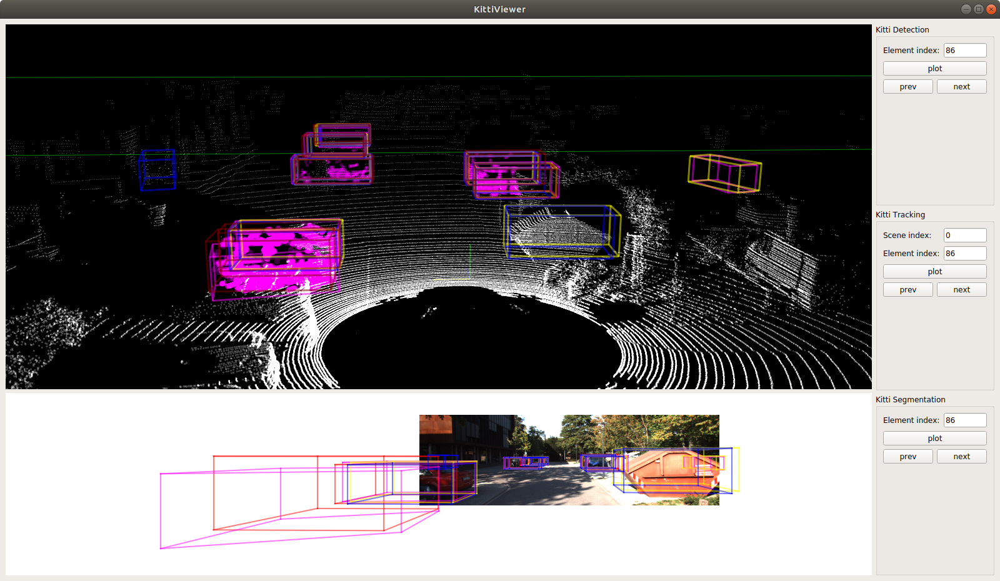
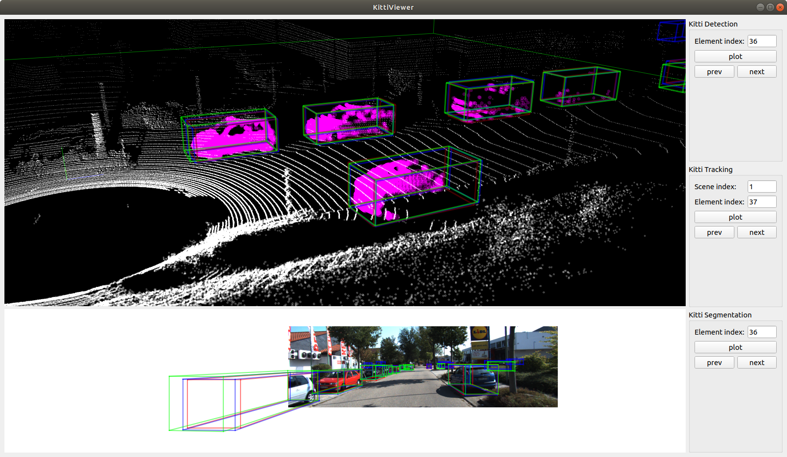
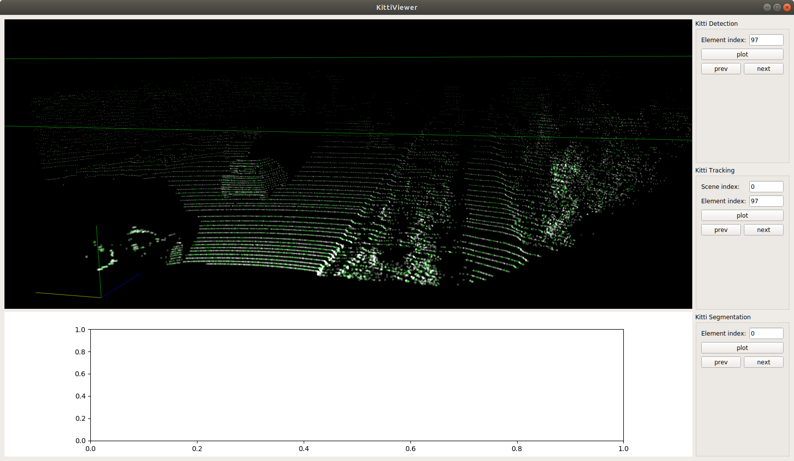

# Python KittiViewer+

This is an upgrade of [Second.KittiViewer](https://github.com/traveller59/second.pytorch#try-kitti-viewer-deprecated)

- Works on raw KITTI data (without `second` preprocessing)
- Allows to compare results of different methods (results must be saved in KITTI format)
- Allows to display segmentation of points

## Install Dependencies

``pip install numba dill matplotlib fire shapely scikit-image PyOpenGL protobuf``

It's easier to use [conda](https://docs.conda.io/en/latest/miniconda.html) to get QT:

``conda install qt pyqt pyqtgraph``

### QT errors
- If you have `“Failed to load platform plugin ”xcb“ ” while launching qt5 app on linux without qt installed` error, it is probably because libxcb-xinerama0 file is not found. You can try run `sudo apt install --reinstall libxcb-xinerama0` to fix it.

## Run

`python viewer.py`

## Parameters 

All parameters are stored in `params.json`.

## KITTI Detection

### Data setup

- `kitti_detection_root` parameter contains a path for detection KITTI dataset. You must have `image_2`, `label_2`, `velodyne`, `calib` folders inside `"selected_split": "training"` folder.

    `"kitti_detection_root": "/data/sets/kitti_second"`

- `folders` parameter contains names for each modality (if you named them differently from KITTI).

    ```json
    "folders": {
        "detection": {
            "calib": "calib",
            "image": "image_2",
            "label": "label_2",
            "velodyne": "velodyne"
        },
    }
    ```

- `compare_results_detection` object describes how to display results from different methods. All results must be stored inside the `root` folder and `methods[i]["name"]` subfolder in KITTI annotations format (.txt files as in `label_2`). `color` field describes RGB color of 3d and 2d boxes.

    ```json
        "compare_results_detection": {

            "root": "/data/sets/kitti_results_detection",
            "methods": [

                {
                    "name": "method1",
                    "color": [1.0, 0.0, 1.0]
                },
                {
                    "name": "method2",
                    "color": [1.0, 1.0, 0.0]
                },
                {
                    "name": "method3",
                    "color": [0.0, 0.0, 1.0]
                }
            ]
        }
    ```

### Example




## KITTI Tracking

### Data setup

- `kitti_tracking_root` parameter contains a path for detection KITTI dataset. You must have `image_2`, `label_2`, `velodyne`, `calib` folders inside `"selected_split": "training"` folder. `image_2` and `velodyne` must have folders for each scene.

    `"kitti_tracking_root": "/data/sets/kitti_tracking"`

- `folders` parameter contains names for each modality (if you named them differently from KITTI).

    ```json
    "folders": {
        "tracking": {
            "calib": "calib",
            "image": "image_2",
            "label": "label_2",
            "velodyne": "velodyne"
        },
    }
    ```
### Example




## KITTI Segmentation (In development)

### Data setup

- `kitti_segmentation_root` parameter contains a path for detection KITTI dataset. You must have `.bin` files `"selected_split": "training"` folder. Each file is created using `dill` library and must contain `segmented_points` (`NxC`, C - amount of classes (currently C=1 only),`original_points` (`Nx3` - with points coordinates), `ground_trurh_points` (`NxC` - with ground truth segmentation)

    `"kitti_segmentation_root": "/data/sets/kitti_segmentation"`

### Example


